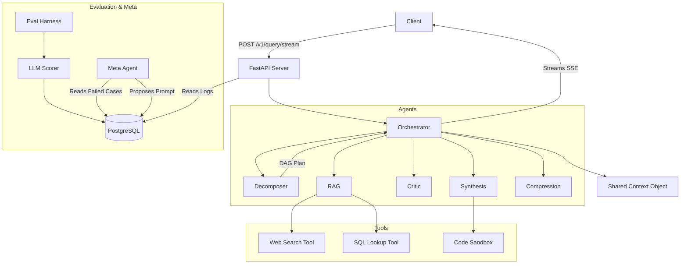

# 🤖 Mega AI: Real-Time Multi-Agent LLM Orchestration

Mega AI is a containerized, production-grade multi-agent system demonstrating dynamic tool orchestration, self-improving evaluation loops, adversarial robustness, and rigorous context management.

## 🚀 Setup Instructions

1. **Clone & Configure**:
   ```bash
   git clone <repo> && cd mega-ai
   cp .env.example .env
   ```
2. **Add API Keys**:
   Edit `.env` to include your LLM credentials (the system uses `litellm` and defaults to standard model names).
   ```env
   LLM_API_KEY=your_api_key_here
   LLM_MODEL=gemini/gemini-2.5-pro # or gpt-4-turbo
   ```
3. **Launch the Stack**:
   ```bash
   docker compose up --build -d
   ```
4. **Trigger Evaluation**:
   ```bash
   docker compose exec worker python -m app.eval.harness
   ```
5. **Test the SSE Stream**:
   ```bash
   curl -N -X POST http://localhost:8000/v1/query/stream -H "Content-Type: application/json" -d '{"query":"What is the capital of France, and can you write a python script to print it?"}'
   ```

## 🏗 Architecture Diagram



## 🧠 Agents & Decision Boundaries

All inter-agent communication passes through the strictly typed `AgentContext` object. Agents *never* call each other directly.

- **Master Orchestrator**: The central nervous system. It holds the shared context, checks budget via the Context Manager before routing, executes the DAG topology, handles tool retries, and yields state changes to the SSE stream.
- **Decomposition Agent**: Boundary: Only parses the ambiguous query and returns a typed JSON DAG of sub-tasks. It does not solve the prompt.
- **RAG Agent**: Boundary: Takes a sub-task, invokes search/SQL tools, performs multi-hop reasoning on retrieved chunks, and appends outputs with strict `[1]` citations back to the context.
- **Critique Agent**: Boundary: Read-only access to existing outputs. It cannot mutate answers. It assigns structured confidence scores and flags exact string spans it disagrees with.
- **Synthesis Agent**: Boundary: Only runs at the end of the DAG. It merges previous outputs, explicitly resolves contradictions flagged by the Critique agent, and generates the final provenance map.
- **Compression Agent**: Boundary: Triggered strictly by the Context Budget Manager. It summarizes unstructured conversational filler while keeping tool outputs and JSON lossless.
- **Meta-Agent**: Boundary: Operates offline post-evaluation. Reads failing test cases and generates updated system prompts. It cannot auto-apply them; human approval is required via the API.

## ⚠️ Known Limitations (Where It Breaks)

An honest assessment of current failure modes:
1. **DAG Cycles (NetworkX Unfeasible)**: If the Decomposer hallucinates an impossible dependency (A -> B -> A), the topological sort falls back to arbitrary parallel execution, which breaks causal dependency logic.
2. **Tool Hallucinations in SQL**: The `SQLLookupTool` restricts to `SELECT` queries, but if the database schema is complex, the LLM will hallucinate non-existent column names, resulting in rapid tool failure loops.
3. **Budget Overflow during Critique**: Because the Critique agent must quote spans, evaluating a massive context can push the system beyond the `MAX_CONTEXT_TOKENS` mid-generation, causing a policy violation before compression can trigger.
4. **Code Execution Sandbox**: The `subprocess` Sandbox executes Python natively. While it catches basic errors and timeouts, a malicious prompt injection (`import os; os.system('rm -rf /')`) inside the docker container is highly dangerous without a true gVisor/firecracker microVM layer.

## 🔄 Self-Improving Loop Boundaries

What it **DOES**:
- Parses structured outputs of failed evaluations.
- Identifies the worst-performing agent along specific dimensions (e.g., `contradiction_resolution`).
- Generates a proposed string replacement for that agent's system prompt.
- Stores the delta for human review.

What it **DOES NOT DO**:
- Automatically deploy or hot-reload code logic.
- Modify the Abstract Syntax Tree (AST) or Python execution paths.
- Alter token limits, temperature, or hyperparameter variables.

## 🔮 Future Work (What I Would Build Next)

1. **Semantic Routing Layer**: Implementing a cheaper, fast model (like Llama-3-8B) exclusively for the Decomposer and Orchestrator routing to save costs, while reserving heavy models (GPT-4) for Synthesis.
2. **True Isolation Sandbox**: Replacing the `subprocess` code execution with an ephemeral, network-isolated Docker-in-Docker or gVisor sandbox to handle adversarial Python injections safely.
3. **Vector Database Integration**: Replacing the Web Search stub with a real `pgvector` or Qdrant implementation for massive document corpus RAG.
4. **Agent Memory**: Adding an Ephemeral Memory agent that persists successful plan patterns across `job_id`s in PostgreSQL to reduce planning latency for repeated query structures.